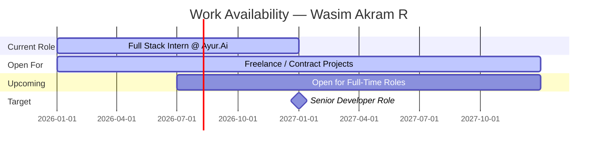

<div align="center">

<!-- Animated Banner -->


<br/>

[](mailto:wasimmsd030@gmail.com)
[](https://linkedin.com/in/wasim-akram)
[](https://github.com/Wasim030)
[](https://github.com/Wasim030/3D-portfolio-with-animation)

<br/>


</div>

---
### 🧑‍💻 About Me

```typescript
const wasim = {
  name: "Wasim Akram R",
  location: "Chennai, India 📍",
  role: "Junior Full Stack Developer",
  company: "Ayur.Ai Private Limited",
  education: "B.E. CSE @ Priyadarshini Engineering College",
  cgpa: "8.0 / 10 🎓",

  currentlyBuilding: [
    "AI Well Smart Healthcare Kiosk",
    "Doctor Dashboard (Full Stack)",
  ],

  askMeAbout: [
    "React.js", "Node.js", "Express",
    "MongoDB", "Kotlin", "REST APIs",
    "JWT Auth", "Stripe Integration"
  ],

  aiToolsIUse: [
    "ChatGPT", "GitHub Copilot",
    "Claude AI", "Gemini AI", "Cursor AI"
  ],

  openToWork: true,
  funFact: "I build apps where AI meets Healthcare 🏥🤖"
};
```

<br clear="right"/>

---

## 🛠️ Tech Arsenal

<div align="center">

### 🌐 Frontend


### ⚙️ Backend & Database


### 📱 Mobile


### ☁️ DevOps & Tools


</div>

---

## 🚀 Featured Projects

<div align="center">
<table>
<tr>
<td width="50%">

### 🏥 MediConnect
> **AI-Powered Doctor Appointment Portal**


- 🔐 JWT + bcrypt auth with RBAC
- 💳 Stripe payment gateway + webhooks
- 👨‍⚕️ Role dashboards: Patient / Doctor / Admin
- 🚀 Deployed on Vercel + Render

[](https://github.com/Wasim030/Medicare-project)

</td>
<td width="50%">

### 🛍️ ShopFlow
> **Full Stack E-Commerce Platform**


- 🛒 Dynamic catalog, cart & order tracking
- 🔑 18+ REST API endpoints
- 🖼️ Cloudinary multi-image uploads
- 🛡️ Custom Express.js RBAC middleware

[](https://github.com/Wasim030/E-commerce-)

</td>
</tr>
<tr>
<td width="50%">

### 📱 AiWell Kiosk
> **Smart Healthcare Kiosk App**


- 📡 BLE integration: BCA machines, smart rings
- 🏗️ MVVM architecture + Jetpack Compose UI
- 🔄 Real-time health data synchronization
- 🩺 Patient wellness & appointment workflows

[](https://github.com/Wasim030/Express-app-)

</td>
<td width="50%">

### 🔐 Cyber Security Tools
> **Ethical Hacking & Security Utilities**


- 🕵️ Keylogger implementations
- 🛡️ Security research tools
- 🔍 Network analysis utilities
- 📚 Educational security demos

[](https://github.com/Wasim030/Cyber_Security)

</td>
</tr>
</table>
</div>

---

## 📊 GitHub Analytics

<div align="center">
  
  
</div>

<div align="center">
  
</div>

<div align="center">
  
</div>

---

### 📅 Work Availability Timeline



---

## 🐍 Contribution Snake

<div align="center">

<picture>
  <source media="(prefers-color-scheme: dark)" srcset="https://raw.githubusercontent.com/Wasim030/Wasim030/output/github-contribution-grid-snake-dark.svg"/>
  <source media="(prefers-color-scheme: light)" srcset="https://raw.githubusercontent.com/Wasim030/Wasim030/output/github-contribution-grid-snake.svg"/>
  
</picture>

</div>

<details>
<summary>⚙️ Click to enable the snake animation — snake.yml</summary>

```yaml
name: Generate Snake Animation

on:
  schedule:
    - cron: "0 0 * * *"
  workflow_dispatch:

jobs:
  generate:
    runs-on: ubuntu-latest
    timeout-minutes: 10
    steps:
      - uses: Platane/snk/svg-only@v3
        with:
          github_user_name: ${{ github.repository_owner }}
          outputs: |
            dist/github-contribution-grid-snake.svg
            dist/github-contribution-grid-snake-dark.svg?palette=github-dark
      - uses: crazy-max/ghaction-github-pages@v3.1.0
        with:
          target_branch: output
          build_dir: dist
        env:
          GITHUB_TOKEN: ${{ secrets.GITHUB_TOKEN }}
```

> Save this as `.github/workflows/snake.yml` in your `Wasim030` repo, then go to **Actions → Generate Snake Animation → Run workflow**.

</details>

---

## 💼 Experience Timeline

```
Jan 2026 ──────────────────────────────── Present
    │
    ├── 🏥  Ayur.Ai Private Limited  (Full Stack Developer Intern)
    │       • Built AI Well Smart Healthcare Kiosk (Kotlin + MVVM + BLE)
    │       • Developed Doctor Dashboard (Full Stack)
    │       • Integrated BCA machines, smart rings via BLE
    │       • Manual & automation testing for AI Well App
    │
Mar 2025 ─────────────────────────── Dec 2025
    │
    └── 🎓  QSpiders  (Full Stack & Software Testing)
            • Core Java, Selenium WebDriver, TestNG
            • 100+ test cases for e-commerce modules
            • Page Object Model (POM) automation
```

---

## 🏆 GitHub Trophies

<div align="center">
  
</div>

---

## 📜 Certifications

<div align="center">

| 🏅 Certificate | 🏛️ Platform |
|---|---|
| React — Complete Guide (Hooks, Router, Redux) | Simplilearn |
| Node.js Developer Course | Eduprep |
| MongoDB Basics | Simplilearn |
| Java Programming | Prodigy Infotech |
| Full Stack Web Development | Eduprep |
| Advanced QA Automation Testing | QSpiders |

</div>

---

## 📬 Contact Me

<div align="center">

### Let's build something amazing together! 🚀

<table>
<tr>
<td align="center" width="200">
  <a href="mailto:wasimmsd030@gmail.com">
    
    <br/><sub><b>wasimmsd030@gmail.com</b></sub>
  </a>
</td>
<td align="center" width="200">
  <a href="https://linkedin.com/in/wasim-akram">
    
    <br/><sub><b>linkedin.com/in/wasim-akram</b></sub>
  </a>
</td>
<td align="center" width="200">
  <a href="https://github.com/Wasim030">
    
    <br/><sub><b>github.com/Wasim030</b></sub>
  </a>
</td>
</tr>
<tr>
<td align="center" width="200">
  
  <br/><sub><b>+91 9597925803</b></sub>
</td>
<td align="center" width="200">
  
  <br/><sub><b>Chennai, India</b></sub>
</td>
<td align="center" width="200">
  
  <br/><sub><b>Open to Work ✅</b></sub>
</td>
</tr>
</table>

<br/>

### 💬 Random Dev Quote


</div>

---

## 🌐 Languages

<div align="center">


</div>

---

<div align="center">

*"First, solve the problem. Then, write the code." — John Johnson*


</div>
